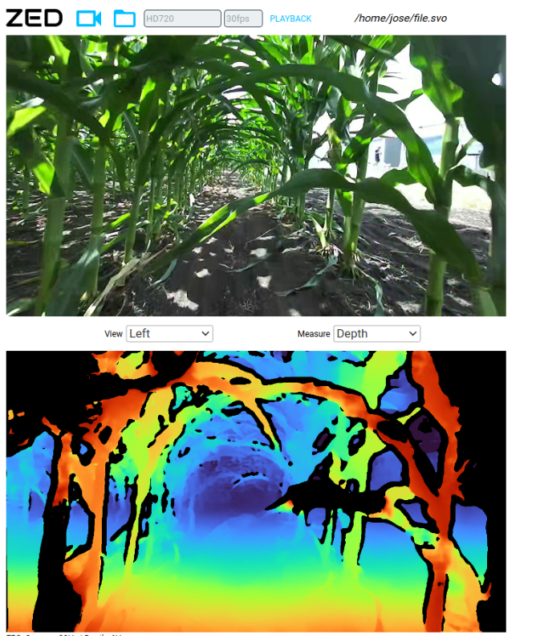
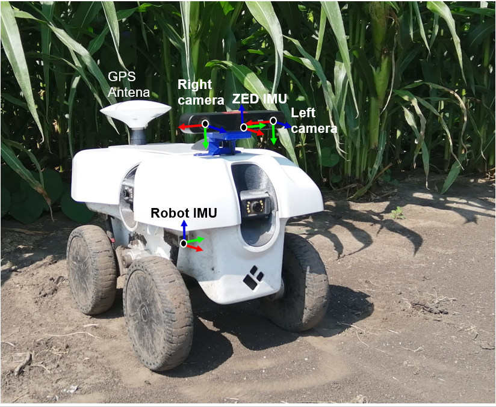

# SLAM-dataset
[Download](https://uofi.box.com/s/l7e0okjxkq1vzz77goac2bu1my81ad9d)

This dataset is intended for the evaluation of visual-based localization and mapping systems in agriculture. It includes stereo
images, IMU, GPS, and wheel encoder measurements. It was collected from a ground robot in the Illinois Autonomous Farm at the
University of Illinois at Urbana-Champaign. The collection campaign took place during the Summer of 2022. Different data sequences
were collected twice per week in corn fields, and less often in soybean and sorghum. This dataset exhibit high variability in terms of
weather conditions and growth stages. It contains challenging features like occlusions, illumination variations, weeds, dynamic objects, and rough terrain.

<div align="center">
  <a href="figures/robot.png">
    
  </a>
</div>

<a href="https://youtu.be/cSIdbHLZzkc?t=119" target="_blank"></a>


## Data description
This dataset is organized in different folders, classified by crop type and collection date (See Table I for further description of each folder).
Within each folder, we find Rosbag (*.bag) and SVO (*.svo) files.
- The Rosbag files comprise standard ROS messages for all the sensor measurements, including the stereo-inertial camera (832x468 px, 30
fps), IMU, GPS, and wheel encoders. It also includes the estimated ground-truth robot pose (by using an EKF). Finally, it includes additional
topics computed by the ZED software development kit (SDK) that you may find helpful for comparison purposes. Among these topics, we have
a VIO topic, a camera pose topic (estimated by a VI-SLAM system), and two path topics (path-odom and path-map), which correspond to the
history of robot poses computed by the VIO and the VI-SLAM system of the ZED SDK. Table II summarizes the topics contained in each
Rosbag file.
- The SVO files comprise right and left images in H265 (HEVC) mode, achieving a compression ratio of 100:1 while keeping high quality. The
image resolution is 1280x720 px. These files can be played using the ZED ROS Wrapper (see tutorial below), to get the same topics as the camera
was connected. One of the advantages of this file format is its compactness and the possibility to get high-quality depth information by using the
neural mode of the ZED software development kit.

### Table I. Main characteristics of data folders
```
Folder          Number of    Time        Occlusions     Presence of     Weather         Growth-stage       Rough      Folder
                sequences    span                       Weeds           variability     variability        terrain    size (GB)
Cornfield1      80           4 months    ✓              ✓               ✓               ✓                  ✓          584
Cornfield2      17           3 months    ✓              ✓               ✓               ✓                  ✓          171
Cornfield3      2            1 week      x              x               x               x                  ✓          28
Cornfield4      4            1 months    ✓              x               x               ✓                  ✓          37
Sorghum         2            3 weeks     ✓              ✓               x               x                  ✓          9
Soybean         12           2 weeks     ✓              ✓               ✓               x                  ✓          79
Sweet Corn      4            1 weeks     ✓              ✓               x               x                  ✓          49
Others          14           3 months    x              x               ✓               ✓                  ✓          103
```


### Table II. ROS topics in Rosbag files
<div align="center">
  <a href="figures/rosbag_topics.png">
    
  </a>
</div>


## Playing SVO files (optional)
### Left image and neural depth computed by the ZED SDK

<div align="center">
  <a href="figures/neural_depth.png">
    
  </a>
</div>

If you want higher resolution images and higher depth quality than that of the rosbag files, then you can use the svo files. Most of them
were recorded simultaneously with the rosbags.
1. Install the [ZED SDK](https://www.stereolabs.com/developers/release/) (You need CUDA)
2. install the [ZED ROS Wrapper](https://www.stereolabs.com/docs/ros/)
3. Play the svo files:
```
cd ~/catkin_ws
source devel/setup.bash
roslaunch zed_wrapper zed2.launch svo_file:=/home/path_to_svo_file/file.svo
```
4. See all the ROS topics as the camera was connected
```
rostopic list
```
You can change the quality of the depth image and other parameters by editing the file common.yaml in the directory:
catkin_ws/src/zed-ros-wrapper/zed_wrapper/params. To get the Intrinsic parameters of the camera, check topics:
- /zed2/zed_node/depth/camera_info
- /zed2/zed_node/left/camera_info
- /zed2/zed_node/right/camera_info

## Building fpn_msgs in your catkin workspace
In order to read the GPS and motor messages, which are user-defined ROS messages, you will need to build them in your catkin workspace. [Further details](http://wiki.ros.org/ROS/Tutorials/CreatingMsgAndSrv).
1. Download the package [fpn_msgs](https://uofi.box.com/shared/static/sxfuvw9njpm2e2mbcfncirdxx70kn165.zip) to your catkin/src folder and unzip the file.
2. Go to your catkin workspace and build the package
```
catkin_make fpn_msgs
```
3. Source your workspace
```
source devel/setup.bash
```

## Sensor calibration
### Robot's coordinate frames
<div align="center">
  <a href="figures/coordinate_frames.png">
    
  </a>
</div>

Check [sensor_parameters.txt](sensor_parameters.txt)