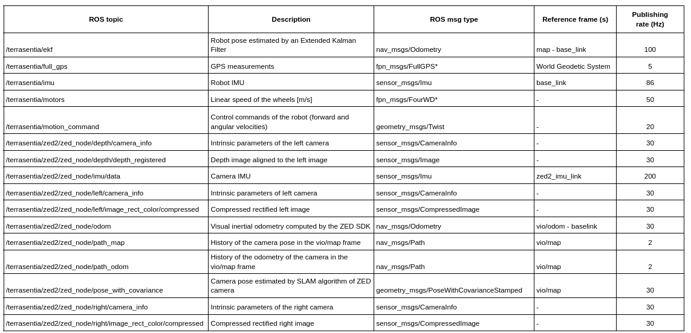

# SLAM-dataset
This dataset is intended for the evaluation of visual-based localization and mapping systems in agriculture. It includes stereo
images, IMU, GPS, and wheel encoder measurements. It was collected from a ground robot in the Illinois Autonomous Farm at the
University of Illinois at Urbana-Champaign. The collection campaign took place during the Summer of 2022. Different data sequences
were collected twice per week in corn fields, and less often in soybean and sorghum. This dataset exhibit high variability in terms of
weather conditions and growth stages. It contains challenging features like occlusions, illumination variations, weeds, dynamic objects, and rough terrain.

<div align="center">
  <a href="figures/robot.png">
    
  </a>
</div>


## Main characteristics of data folders
```
Folder          Number of           Time           Occlusions          Presence of           Weather         Growth-stage            Rough      Folder
                sequences           span                               Weeds                 variability     variability             terrain    size (GB)
Cornfield1      80                  4 months       ✓                   ✓                     ✓               ✓                       ✓          584
Cornfield2      17                  3 months       ✓                   ✓                     ✓               ✓                       ✓          171
Cornfield3      2                   1 week         x                   x                     x               x                       ✓          28
Cornfield4      4                   1 months       ✓                   x                     x               ✓                       ✓          37
Sorghum         2                   3 weeks        ✓                   ✓                     x               x                       ✓          9
Soybean         12                  2 weeks        ✓                   ✓                     ✓               x                       ✓          79
Sweet Corn      4                   1 weeks        ✓                   ✓                     x               x                       ✓          49
Others          14                  3 months       x                   x                     ✓               ✓                       ✓          103
```

## ROS topics in Rosbag files
<div align="center">
  <a href="figures/rosbag_topics.png">
    
  </a>
</div>


## Playing SVO files (optional)
### Left image and neural depth computed by the ZED SDK
<div align="center">
  <a href="figures/neural_depth.png">
    
  </a>
</div>
If you want higher resolution images and higher depth quality than that of the rosbag files, then you can use the svo files. Most of them
were recorded simultaneously with the rosbags.
1. Install the [ZED SDK](https://www.stereolabs.com/developers/release/) (You need CUDA)
2. install the [ZED ROS Wrapper](https://www.stereolabs.com/docs/ros/)
3. Play the svo files:
```
cd ~/catkin_ws
source devel/setup.bash
roslaunch zed_wrapper zed2.launch svo_file:=/home/path_to_svo_file/file.svo
```
4. See all the ROS topics as the camera was connected
```
rostopic list
```
You can change the quality of the depth image and other parameters by editing the file common.yaml in the directory:
catkin_ws/src/zed-ros-wrapper/zed_wrapper/params. To get the Intrinsic parameters of the camera, check topics:
- /zed2/zed_node/depth/camera_info
- /zed2/zed_node/left/camera_info
- /zed2/zed_node/right/camera_info

