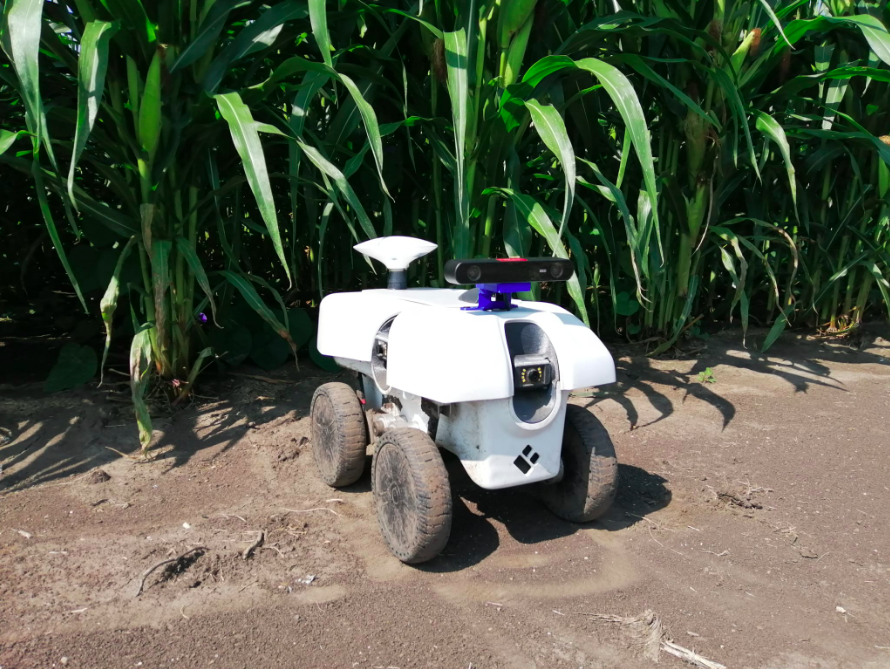

# SLAM-dataset
This dataset is intended for the evaluation of visual-based localization and mapping systems in agriculture. It includes stereo
images, IMU, GPS, and wheel encoder measurements. It was collected from a ground robot in the Illinois Autonomous Farm at the
University of Illinois at Urbana-Champaign. The collection campaign took place during the Summer of 2022. Different data sequences
were collected twice per week in corn fields, and less often in soybean and sorghum. This dataset exhibit high variability in terms of
weather conditions and growth stages. It contains challenging features like occlusions, illumination variations, weeds, dynamic objects, and rough terrain.

<div align="center">
  <a href="figures/robot.png">
    
  </a>
</div>


```
Description
Folder          Time span           Occlusions          Weeds           Weather         Growth stage            Rough terrain           People
----------------
Cornfield1      4 months            ✓                   ✓               ✓               ✓                       ✓                       x
Cornfield2      3 months            ✓                   ✓               ✓               ✓                       ✓                       x
Cornfield3      1 week              x                   x               x               x                       ✓                       x
```

ZED SDK ([reference](https://www.stereolabs.com/docs/installation/))
